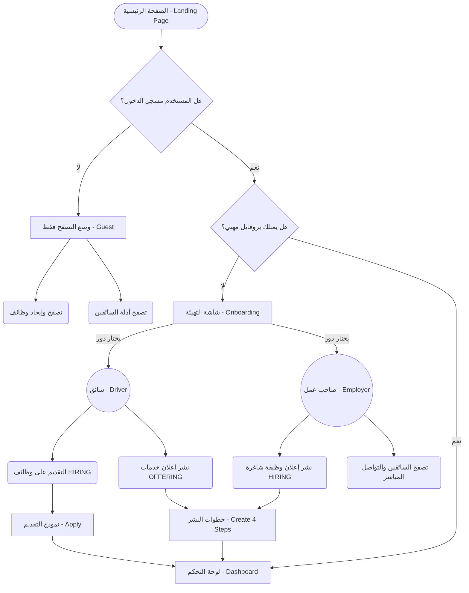

# 🏢 الدليل الشامل لقسم الوظائف (Jobs Section Walkthrough)

هذا الملف يشرح هيكلة قسم الوظائف بالكامل، تسلسل الصفحات، وصلاحيات المستخدمين بناءً على دورهم (سائق أو صاحب عمل).

## 🗂 الصفحات الموجودة (Pages)
يحتوي القسم على مجموعة من الشاشات موزعة كالتالي:

1. **الصفحة الرئيسية (`app/jobs/index.tsx`)**: الواجهة الأساسية التي تجمع كل أقسام الوظائف (أحدث الطلبات، أمهر السائقين، خدمات معروضة).
2. **تصفح الوظائف (`app/jobs/browse.tsx`)**: شاشة البحث والفلترة لجميع الإعلانات (سواء كانت طلب توظيف أو عرض خدمة).
3. **تصفح السائقين (`app/jobs/drivers/index.tsx`)**: شاشة مخصصة لأصحاب العمل للبحث في قاعدة بيانات السائقين المسجلين.
4. **تفاصيل الوظيفة (`app/jobs/[id].tsx`)**: صفحة عرض الإعلان بالكامل (الراتب، الشروط، الموقع).
5. **بروفايل السائق (`app/jobs/drivers/[id].tsx`)**: السيرة الذاتية للسائق (الرخص، الخبرات، التقييم).
6. **التقديم على الوظيفة (`app/jobs/apply/[id].tsx`)**: نموذج لرفع الـ CV وإرسال طلب التوظيف.
7. **نشر إعلان (`app/jobs/create*.tsx`)**: خطوات (Wizard) من 4 صفحات لنشر إعلان جديد.
8. **التهيئة - Onboarding (`app/jobs/onboarding.tsx`)**: شاشة إنشاء البروفايل المهني لتحديد دور المستخدم.
9. **لوحة التحكم (`app/jobs/dashboard.tsx`)**: شاشة إدارة الإعلانات والطلبات الخاصة بالمستخدم.
10. **توثيق الحساب (`app/jobs/verification.tsx`)**: رفع الهوية لتوثيق الحساب والحصول على شارة الثقة.

---

## 🔐 الصلاحيات والأدوار (Permissions & Roles)

ينقسم المستخدمون في التطبيق إلى ثلاث فئات:

> [!NOTE] 
> **1. الزائر (الغير مسجل)**
> يمكنه **فقط** تصفح الوظائف، تصفح السائقين، ورؤية التفاصيل. **لا يمكنه** التقديم، النشر، أو رؤية لوحة التحكم.

> [!TIP] 
> **2. السائق (Driver)**
> - **الصلاحيات:** يمتلك بروفايل عام يراه أصحاب العمل.
> - **التقديم:** يمكنه التقديم على وظائف من نوع `HIRING` (شركات تطلب موظفين).
> - **النشر:** يمكنه نشر إعلانات من نوع `OFFERING` (سائق يعرض خدماته الخاصة).

> [!IMPORTANT]
> **3. صاحب العمل (Employer)**
> - **الصلاحيات:** يمكنه البحث وتصفح بروفايلات السائقين المتاحة.
> - **النشر:** يمكنه إضافة إعلانات وظائف شاغرة `HIRING`.
> - **الاستقبال:** يستقبل السير الذاتية والطلبات من السائقين في لوحة التحكم.

---

## 🔄 دورة حياة المستخدم (User Flow Diagram)

الرسم البياني التالي يوضح مسار المستخدم بداية من دخول الصفحة الرئيسية وحتى التفاعل مع النظام:

---

## ⚙️ الشرح المبسط للترتيب (Flow Explanation)

1. **نقطة الدخول:** يدخل المستخدم إلى `index.tsx`، إذا أعجبه شيء وحاول التفاعل (مثلاً: اضغط للتقديم).
2. **التحقق (Auth):** النظام يتأكد من تسجيل دخوله، لو غير مسجل يُرسل لصفحة `Login`.
3. **التهيئة (Onboarding):** بعد التسجيل، إذا لم يكن لديه حساب مهني، يُجبر على المرور بـ `onboarding.tsx` ليختار هل هو (سائق) أم (شركة/صاحب عمل)، وكل اختيار يعرض فورم مخصص لجمع البيانات (أنواع الرخص للسائق، أو اسم الشركة لصاحب العمل).
4. **التفاعل (Action):**
   - السائق يملأ فورم `apply/[id].tsx` المكون من بيانات شخصية ورفع الـ CV للوظائف المتاحة.
   - صاحب العمل يمر بـ 4 خطوات في `create.tsx` لتحديد نوع المركبة، الراتب، الشروط ونشر الإعلان.
5. **المتابعة (Tracking):** يعود الجميع إلى `dashboard.tsx` لمتابعة حالة إعلاناتهم أو الطلبات التي قدموها.

